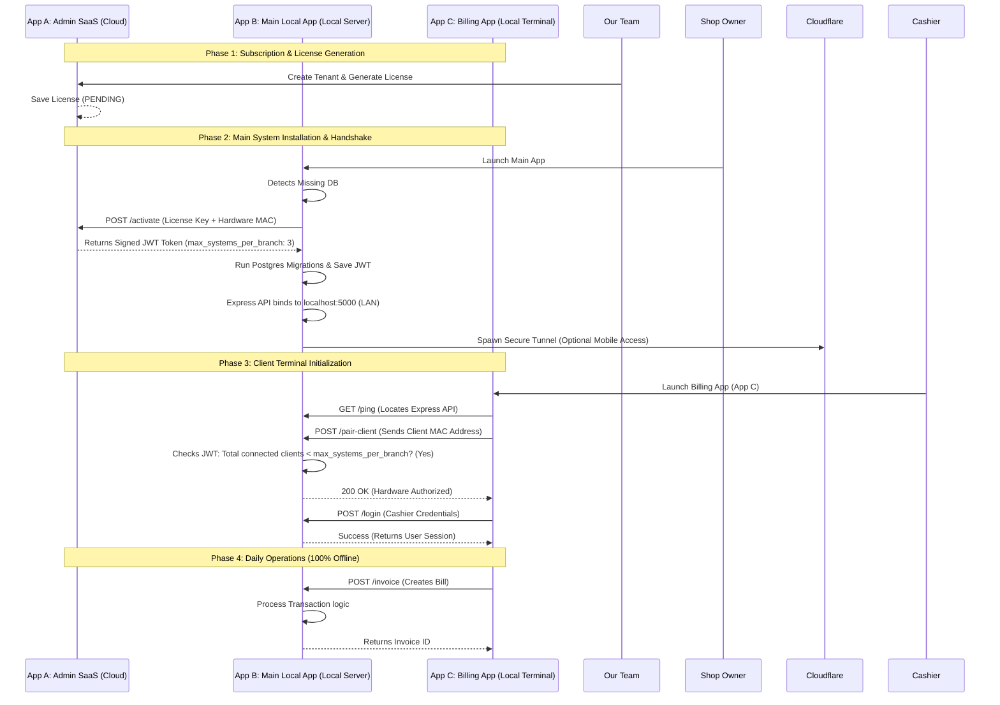

# System Communication Flow Diagram

The following diagram illustrates how the three applications (App A, App B, and App C) connect to formulate the full Shop Management System ecosystem.

```mermaid
sequenceDiagram
    participant Admin as App A: Admin SaaS (Cloud)
    participant Main as App B: Main Local App (Local Server)
    participant Client as App C: Billing App (Local Terminal)
    
    Note over Admin, Client: Phase 1: Subscription & License Generation
    Our Team->>Admin: Create Tenant & Generate License
    Admin-->>Admin: Save License (PENDING)
    
    Note over Admin, Client: Phase 2: Main System Installation & Handshake
    Shop Owner->>Main: Launch Main App
    Main->>Main: Detects Missing DB
    Main->>Admin: POST /activate (License Key + Hardware MAC)
    Admin-->>Main: Returns Signed JWT Token (max_systems_per_branch: 3)
    Main->>Main: Run Postgres Migrations & Save JWT
    Main->>Main: Express API binds to localhost:5000 (LAN)
    Main->>Cloudflare: Spawn Secure Tunnel (Optional Mobile Access)
    
    Note over Admin, Client: Phase 3: Client Terminal Initialization
    Cashier->>Client: Launch Billing App (App C)
    Client->>Main: GET /ping (Locates Express API)
    Client->>Main: POST /pair-client (Sends Client MAC Address)
    Main->>Main: Checks JWT: Total connected clients < max_systems_per_branch? (Yes)
    Main-->>Client: 200 OK (Hardware Authorized)
    Client->>Main: POST /login (Cashier Credentials)
    Main-->>Client: Success (Returns User Session)
    
    Note over Admin, Client: Phase 4: Daily Operations (100% Offline)
    Client->>Main: POST /invoice (Creates Bill)
    Main->>Main: Process Transaction logic
    Main-->>Client: Returns Invoice ID
```
